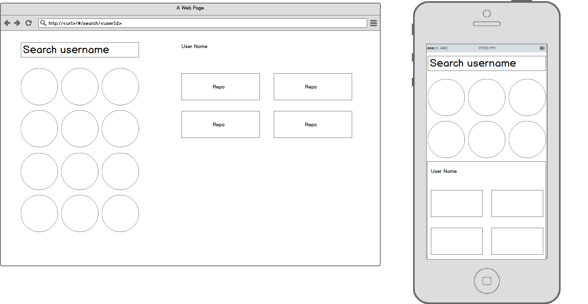

Day 1:
- Create a project with vue-cli
- Create mockups with balsamiq
- Check out Spectre CSS for simple css framework
- Check out vue-router for routing the application
- Design and create routes for the application
- Create components to handle the routes
- Figure out how to use scss with vue components
- Check out axios for ajax library with vue
- Check out vuex for state management
- Add handling of ajax errors
- Convert rw.js into es6 module to make it work with vue and webpack. rw.js is a small library/utilities/plugins I have accumulated and always copy to new projects.

Day 2:
- Handle responsive styles for mobile and tablet. See mixins.scss
- Figure out how to unit test components
- Figure out the ability to mock dependencies such as axios
- Write documentation
- More testing. Discovered a bug on vue-loader and reported it to Vue team.  
  https://github.com/vuejs/vue-loader/issues/924
- Clean up documentation

Notes:
- vue-cli includes eslint config from airbnb. I have found the style guide to be too restrictive, especially when debugging. They also force comma dangle which would actually cause an issue on older IE (not an issue here since it is transpiled). The other default eslint option with vue-cli omits the semicolon, which I think is worse so at the end I chose airbnb version.

Mockup:

