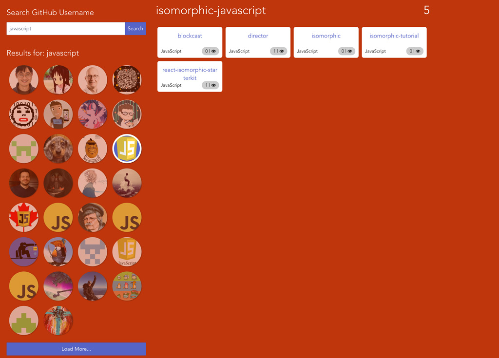

# Github Repository Browser

Github repository browser allows you to search github users, and browse their repositories. The framework I have chosen for this assignment is Vue.js. This is my first time building an application with it. Please see [DEV-DIARY.md](./DEV-DIARY.md) for more info on the process.

## The Application



## Development Setup

First, install the required dependencies by running:
``` bash
$ npm install
```

Then run the dev server by executing:
``` bash
$ npm run dev
```

This will allow you to run your codes on http://localhost:8080 and webpack will hot reload them every time you make changes.

## Test Setup

You can run a single execution of unit testing by running:
``` bash
$ npm run test
```

When developing your unit tests, you can run:
``` bash
$ npm run dev-test
```

This will run your test and restart the process every time you make change to the files

## Deployment for production

Package the application by running:
``` bash
$ npm run build
```

The minified application will be in the generated dist folder. You can install serve and run the files by executing:
``` bash
$ npm install -g serve
$ serve dist
